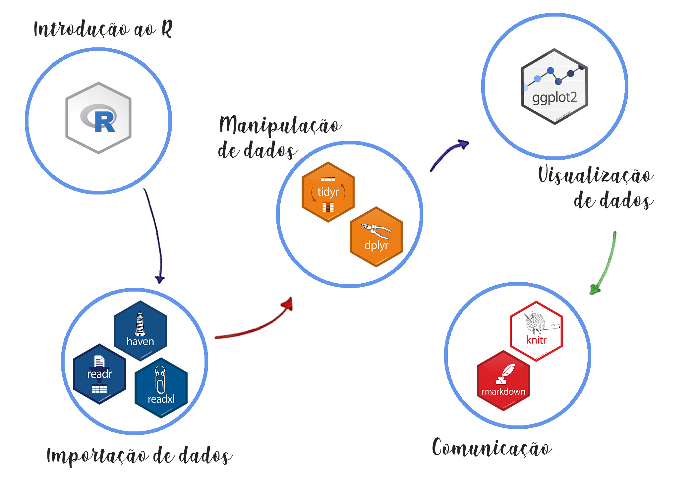
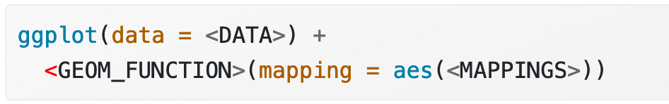

```{r setup, include=FALSE}
library(magrittr)
library(comerciobr)
library(tidyverse)
options(htmltools.dir.version = FALSE)
```

class: center, middle

# O que será ensinado?

???

- Um fragmento da Ciência de Dados. Como lidar com dados a partir de princípios da programação.

# O que não será ensinado?

- Cálculo, álgebra linear, probabilidade, estatística... todos esses conceitos são fundamentais para a ciência de dados mas não serão abordados nesse curso.
- O curso terá foco no uso de ferramentas simples, intuitivas (nem sempre) com impacto imediato mesmo para os que, como eu, são completamente ignorantes em matemática.

- Aula dividida em quatro partes

1. Por que programar 
2. Básico do R
3. O tidyverse e conceitos básicos do dialeto
4. ggplot2

---
class: center, middle

## Todo diplomata deve aprender a programar?

--

.center[]

---
class: inverse

## O Itamaraty precisa de diplomatas que saibam programar

.center[]

???

# Programando

1. programar não é obrigatório, mas ajuda.
2. em terra de cego quem tem um olho é rei.
3. abertura de inúmeras possibilidades.
4. Alfabetismo mínimo digital.

- pra mim, um mínimo de conhecimento a respeito de computadores é uma questão mínima de cidadania. assim como é fundamental pra cidadania saber cozinhar, dominar os materiais para limpar a casa... do mesmo jeito que é fundamental entender o modo do funcionamento dos Estados, das instituições, também é fundamental entender um mínimo do funcionamento de computadores. Mal não faz.

# política pública baseada em evidências

1. a gramática do Estado moderno é baseada na racionalidade.
2. a racionalidade atual precisa ser traduzida para a linguagem dos dados. É assim que o TCU pensa. Muitas vezes é assim que o próprio congresso pensa, às vezes num tipo de raciocínio simplório. 
3. não basta simplesmente sustentar uma determinada posição por valores estranhos, é preciso que ela esteja traduzida na linguagem dos dados.

---
class: center, middle

# O que é Ciência de Dados?

???

- Tomar cuidado com o hype. Cloud computing. Machine Learning. Big Data.
- Há muito debate. Usaremos o conceito mais amplo possível. Qualquer tipo de trabalho e interpretação de dados. Não necessariamente usando programação. Usar programação é, ao meu ver, a melhor maneira de se fazer data science.

---
class: inverse, middle, center
# Não seria melhor simplesmente aprender Excel?

???

# Problemas de se aprender Excel exclusivamente:

1. Estamos limitados ao GUI. Todo o trabalho é se adaptar à interface. Não dá pra fazer nada além disso.
2. Não dá pra saber o que foi feito. Não há como recuperar o processo de construção da base de dados.
3. Perda de reprodutibilidade.

--

.center[]

---

# Vantagens da programação:

--

.center[
.texto[Código é texto]
]

---

# Vantagens da programação

## Códigos são:

--

- Compartilháveis

--

- Reproduzíveis (princípio básico de qualquer ciência)

--

- Legíveis

--

- Abertos

---

# Vantagens da programação

--

1. Copiar e Colar

--

2. Usar o Google

???

Essas tecnologias podem parecer pouca coisa, mas são nada menos que revolucionárias. No entanto, eu vou pedir para vocês não usarem copiar e colar. Eu explico mais tarde o porquê.

Outras vantagens:

- habilidade cada vez mais relevante, tanto no nível pessoal quanto no nível profissional;

- tendência de valorização com o passar do tempo;

- em terra de cego..

---
class: center, middle, inverse

# Não seria melhor aprender Python?

--

.center[]

???

Resposta simples: confiem em mim. Para nossos objetivos, enquanto diplomatas, python não é melhor.

Resposta longa: ela virá a seguir.


---
class: middle, center
.center[
```{r, echo = FALSE, out.height=300}
knitr::include_graphics("https://upload.wikimedia.org/wikipedia/commons/thumb/1/1b/R_logo.svg/1280px-R_logo.svg.png")
```
]

???
# R

1. R é a melhor língua para nossos objetivos.
2. vocês não querem ir trabalhar na dinfor escutar o pessoal da CAT enchendo o saco porque a intratec não está funcionando.
3. o foco do R não é produção de produtos de tecnologia da informação.
4. o foco do R é ser um instrumento de análise para embasamento de decisões de organizações ou, no nosso caso, embasar políticas públicas.
5. o Itamaraty, desde o fim da DIC, não possui divisão específica voltada à Ciência de Dados. Há uma oportunidade, baseada nos últimos avanços tecnológicos da ciência de dados. Nem TI, nem ciência da computação. Ciência de Dados.

---
class: middle, center

# Como o R pode contribuir para o trabalho de um diplomata?

???

- subsídios: mostrar o RMarkdown;
- retratoeconomico: mostrar o Shiy;
- salarios: mostrar o webscraping;
- salarios_app: mostrar o shiny;
- onu: dados de pdfs;
- antiguidade: dados de pdfs;

Outras possibilidades..

- Setor econômico: dados comerciais, tarifários, investimentos..
- Setor político: análise de dados eleitorais; (PolData)
- Postos multilaterais: previsão de votações; orçamento da OI; histórico de decisões;
- Setor administrativo: visualização do impacto de decisões orçamentárias no posto ou na SERE; controle de inventário; 
- Setor de consular: controle de atendimentos; prestação de contas;


---
class: center, middle, inverse

## Oportunidades proporcionais à falta de modernização do Itamaraty

???

Dar alguns exemplos sobre o que pode ser feito:

- As áreas de promoção comercial e administrativas são algumas das áreas que mais facilmente podem ter dinâmicas automatizadas no ministério.

- Divulgação de feiras no exterior. Informações econômicas.

- Na área administrativa: um aplicativo que mostre os salários. Que pondere pelo custo de vida. (mostrar o meu site.)

- aplicativo com dados de antiguidade

- Aplicativo para as remoções. 

- Preços de imóveis no exterior

---

# Conselhos para iniciantes em programação 

--

- Calma!
  .center[]

???

- A maior parte dos erros são pequenas bobagens. Às vezes, o melhor que podemos fazer é manter a calma e, talvez, tentar dar um tempo e resolver o problema mais tarde.

---

# Conselhos para iniciantes em programação

- Computadores são muito temperamentais.

???

- É bom se acostumar com isso.

---

# Conselhos para iniciantes em programação

- Programar é como aprender uma língua estrangeira (só se aprende praticando).

- Tente não copiar e colar.

???

- Learn The Hard Way. Estilo gambito da rainha. 

---

# Conselhos para iniciantes em programação

- Tenha seu projeto.

---
# Conselhos para iniciantes em programação

## Procure ajuda

1. Ler a Documentação!

1. [Google](www.google.com)

2. [Cheat Sheets do R Studio](https://rstudio.com/resources/cheatsheets/)

3. [Stack Overflow](https://pt.stackoverflow.com/)

4. [Discourse do Curso-R](https://discourse.curso-r.com/t/como-escrever-uma-boa-pergunta/542)

5. [Comunidade R-Brasil no Telegram](https://t.me/rbrasiloficial)

6. [Hashtag #rstats nom Twitter](https://twitter.com/hashtag/rstats/)

7. [E-mail ou Zap para Fernando Bastos](fernando.bastos@itamaraty.gov.br)

???

É absolutamente fundamental saber onde procurar ajuda. Programar é basicamente saber usar o google.

---
class: middle, center
```{r, echo = FALSE, out.width="90%"}
knitr::include_graphics("https://memegenerator.net/img/instances/67791412/not-sure-if-i-am-good-at-programming-or-good-at-googling.jpg")
```
---

# O RStudio

```{r echo=FALSE, fig.align='center', out.width=500, out.height=400}

knitr::include_graphics("images/rstudio-editor.png")

```

---

# Primeiras Linhas de Código

## O R como Calculadora

(vamos ao R!)

.center[]

---

# Por que aprender R?

--

## Por causa deste homem: [Hadley Wickham](https://twitter.com/hadleywickham)
.center[
```{r, echo = FALSE, out.height=400}
knitr::include_graphics("images/hadley.jpg")
```
]

???

- O material em R é de muito mais qualidade. Não precisa de vídeos de Youtube.

---

## Comunidade

- [R-Bloggers](https://www.r-bloggers.com/)
- [R-Ladies Global](https://rladies.org/)
- [R-Ladies SP](https://www.meetup.com/pt-BR/R-Ladies-Sao-Paulo/)
- [Minas Programam](https://minasprogramam.com/quem-faz/)


---
# Por que aprender R?

```{r, echo = F}
knitr::include_graphics("images/tidyverse-default.png")

```

???

- O Tidyverse
- Um grande debate entre o R clássico e o tidyverse
- Programação para quem não sabe programar;
- O R se adapta melhor ao trabalho do diplomata;
- Lidar com dados é mais importante que lidar com computadores;
- O R permite reprodutibilidade;

---

# O que é o Tidyverse?

--

- Uma maneira de lidar com dados;
- Um conjunto de ferramentas;
- Uma coleção de boas práticas;
- Uma gramática de dados.

---

# Visão Panorâmica
.center[
```{r, echo = F, out.width="80%"}
knitr::include_graphics("images/ciclo-ciencia-de-dados-pacotes.png")

```
]
.footnote[imagem retirada de [apresentação](https://curso-r.github.io/main-intro-programacao/slides/01-introducao-ao-curso.html#26) do Curso-R
]

???

Essas são as ferramentas que utilizaremos em 99% do tempo. Praticamente tudo o que eu fiz de útil pro Itamaraty foi utilizando essas ferramentas.

No início pode parecer overwhelming, mas vocês vão ver como isso não é tão complicado.

---

# Visão Panorâmica
.center[
```{r, echo = F, out.width="80%"}

```
]
.footnote[imagem retirada de [apresentação](https://curso-r.github.io/main-intro-programacao/slides/01-introducao-ao-curso.html#26) do Curso-R
]

---

# O que é o formato "Tidy"? 


```{r, echo = F}
knitr::include_graphics("images/tidydata_1.jpg")

```

.footnote[Arte por @allison_horst]

???

- Se existe um conceito que eu gostaria que vocês compreendessem dessa aula, o conceito é o de tidy data.
- Este conceito, sozinho, fez com que eu resolvesse o meu problema. É algo que eu nunca teria encontrado se tivesse trabalhado com outras linguagens de programação.

---
# Tabela em formato Tidy

```{r, echo = F, warning = F, message = F}
comerciobr::sh1_df %>% 
  select(co_ano, no_pais, value) %>% 
  group_by(co_ano, no_pais) %>% 
  summarise(value = sum(value)) %>% 
  head(10) %>% 
  kableExtra::kbl() 
  
```
---

# Tabela em formato não Tidy

```{r, echo = F, warning = F, message = F}
comerciobr::sh1_df %>% 
  select(co_ano, no_pais, value) %>% 
  group_by(co_ano, no_pais) %>%
  summarise(value = sum(value)) %>%
  pivot_wider(names_from = co_ano, values_from = value) %>% 
  head(10) %>% 
  kableExtra::kbl() %>% 
  kableExtra::kable_styling()
  
```

---

# Vantagens de se usar tabelas em formato "tidy"

- Padronização de Ferramantas

```{r, echo = F}

knitr::include_graphics("images/tidydata_3.jpg")

```

???

Este conceito pode ser utilizado em praticamente qualquer tabela. Com qualquer tipo de informação.

---

# Vantagens de se usar tabelas em formato "tidy"

- Compartilhamento

--

- Automatização

--

- Padronização

---

# Pacotes

## Unidade básica de compartilhamento de funcionalidades.

- Intalação de pacotes:

```{r}
# install.packages("tidyverse")
```

--

- uso de pacotes:

```{r}
# library(tidyverse)
```

---

# Visualização de dados

```{r echo=FALSE, fig.align='center', out.width=400, out.height=400}

knitr::include_graphics("images/ggplot2.png")

```


---

# A Gramática dos Gráficos


```{r echo=FALSE, fig.align='center'}



```

```{r}
# # httr::GET("https://balanca.economia.gov.br/balanca/bd/comexstat-bd/ncm/EXP_2020.csv", httr::write_disk(here::here("aulas/aula1_introducao/dados/exp_2020.csv"), overwrite = T), config = httr::config(ssl_verifypeer = FALSE))
# 
# # httr::GET("https://balanca.economia.gov.br/balanca/bd/tabelas/NCM_SH.csv", httr::write_disk(here::here("aulas/aula1_introducao/dados/sh.csv"), overwrite = T), config = httr::config(ssl_verifypeer = FALSE))
# # 
# # httr::GET("https://balanca.economia.gov.br/balanca/bd/tabelas/NCM.csv", httr::write_disk(here::here("aulas/aula1_introducao/dados/ncm_sh.csv"), overwrite = T), config = httr::config(ssl_verifypeer = FALSE))
# 
# exp <- vroom::vroom(here::here("aulas/aula1_introducao/dados/exp_2020.csv")) %>% 
#   janitor::clean_names() %>% 
#   select(-c(co_unid, co_via, co_urf, qt_estat))
# 
# ncm_sh <- vroom::vroom(here::here("aulas/aula1_introducao/dados/ncm_sh.csv"), locale = locale(encoding = "ISO-8859-1")) %>% 
#   janitor::clean_names()
# 
# sh <- vroom::vroom(here::here("aulas/aula1_introducao/dados/sh.csv"), locale = locale(encoding = "ISO-8859-1")) %>% 
#   janitor::clean_names()
# 
# ncm_sh <- ncm_sh %>% 
#   select(co_ncm, co_sh6, co_fat_agreg, no_ncm_por)
# 
# exp <- exp %>% 
#   left_join(ncm_sh)
# 
# exp_china <- exp %>% 
#   filter(co_pais == "160")
# 
# 
# exp_china %>% 
#   group_by(co_sh6, sg_uf_ncm, co_fat_agreg) %>%
#   summarise(value = sum(vl_fob),
#             value_kg = sum(kg_liquido)) %>% 
#   group_by(co_sh6) %>% 
#   mutate(sum_sh6 = sum(value)) %>% 
#   arrange(desc(sum_sh6)) %>% 
#   ungroup()
#   # group_by(co_sh6) %>% 
#   slice_max(order_by = sum_sh6, n = 10)
# 
# 
#   pull(co_sh6)
#   ggplot() +
#   geom_col(aes(vl_fob, kg_liquido, color = co_sh6))
#   facet_wrap(~ co_fat_agreg)


```


--

Três funções:

--

- ggplot()
  - Cria o quadro;
  
--

- geom_algo()
  - Cria a figura geométrica desejada;
  
--

- aes()
  - Inclui as variáveis desejadas na figura geométrica
  
---

# Vamos ao RStudio!

  


---

- manipulação de dados públicos (FMI, OCDE, MEcon)

--

- manipulação de dados não tão públicos (webscraping)

--

- otras cositas más 

---
